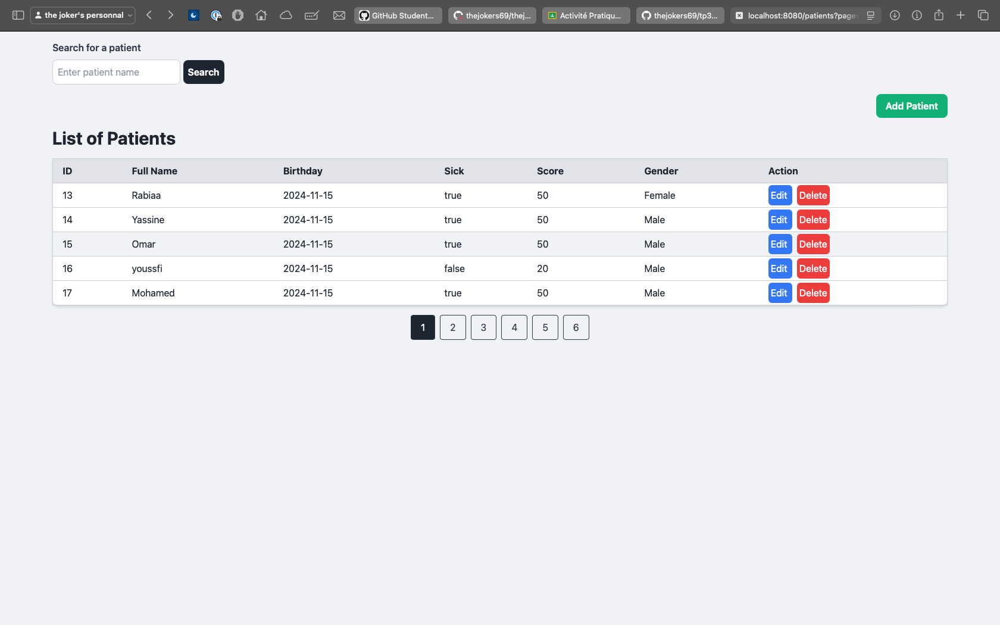
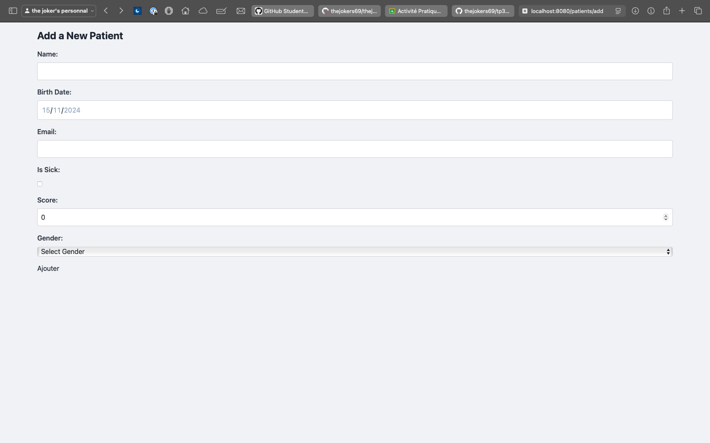
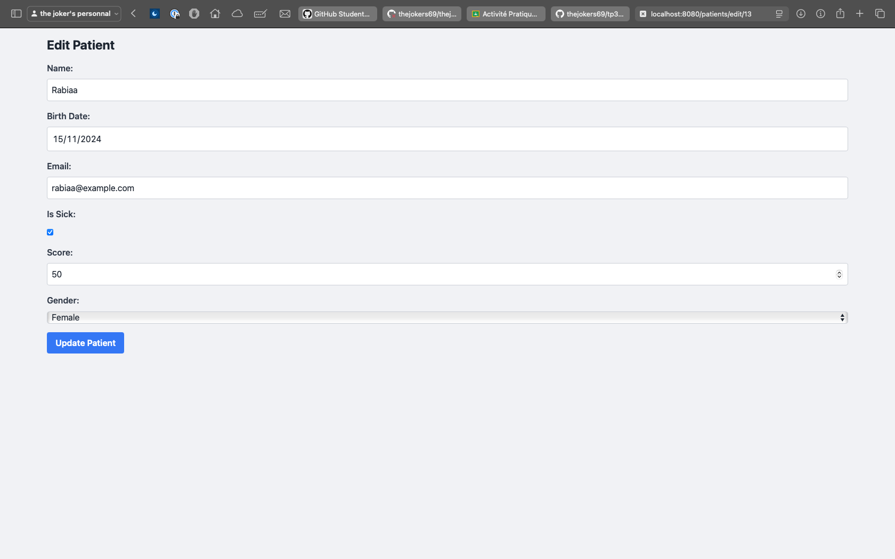

# tp3_Gere_Patient
### Activité Pratique N°3 - Spring MVC - Gestion des Patients

This is a Spring MVC application for managing patient records. It allows users to perform various operations on patient data, including adding, viewing, updating, and deleting patient records.

## Project Requirements

The application includes the following functionalities:
- **Afficher les patients**: Display a list of patients.
- **Faire la pagination**: Paginate the list of patients for easier browsing.
- **Chercher les patients**: Search for specific patients by name.
- **Ajouter un patient**: Add a new patient to the database with options for name, birth date, email, sick status, score, and gender (Male/Female).
- **Supprimer un patient**: Delete a patient record from the database.
- **Modifier un patient**: Edit an existing patient’s details.
- **Faire des améliorations supplémentaires**: Additional enhancements such as form validation and user feedback.

## Technologies Used

- **Spring MVC**: For the web framework.
- **Thymeleaf**: For server-side rendering of HTML templates.
- **Spring Data JPA**: For data access and ORM.
- **MySQL**: As the database for storing patient records.
- **Tailwind CSS (optional)**: For styling the frontend (used in templates).

## Prerequisites

- **Java 17 or later**
- **MySQL database**

## Project Setup

1. **Clone the repository**:
    ```bash
    git clone https://github.com/your-username/tp3_Gere_Patient.git
    cd tp3_Gere_Patient
    ```

2. **Configure the Database**:
    Update `src/main/resources/application.properties` with your MySQL database credentials:
    ```properties
    spring.datasource.url=jdbc:mysql://localhost:3307/mundiapolis?createDatabaseIfNotExist=true
    spring.datasource.username=YOUR_DB_USERNAME
    spring.datasource.password=YOUR_DB_PASSWORD
    spring.jpa.hibernate.ddl-auto=update
    spring.jpa.properties.hibernate.dialect=org.hibernate.dialect.MySQL8Dialect
    ```

3. **Run the Application**:
    ```bash
    ./mvnw spring-boot:run
    ```

4. **Access the application** at [http://localhost:8080](http://localhost:8080).

## Application Features

- **Patient List**: View all patients with details like ID, Name, Birth Date, Email, Sick status, Score, and Gender.
- **Add Patient**: Navigate to the “Add Patient” form to add a new patient with full details.
- **Edit Patient**: Click “Edit” next to a patient to modify their information.
- **Delete Patient**: Remove a patient record by clicking the “Delete” button next to their name.
- **Search and Pagination**: Search for patients by name and paginate through the results.
- **Form Validation**: Ensure all fields are correctly filled before submitting forms.

## Screenshots

1. **List of Patients**: Displays all patient records with pagination and search functionality.
2. 
3. **Add/Edit Patient**: A form for adding or editing patient information, with validation for required fields.
4. 
5. 
## Additional Resources

- [Spring MVC Documentation](https://docs.spring.io/spring-framework/docs/current/reference/html/web.html)
- [Thymeleaf Documentation](https://www.thymeleaf.org/documentation.html)
- [Spring Data JPA Documentation](https://docs.spring.io/spring-data/jpa/docs/current/reference/html/)

This updated README.md reflects the requirements of the assignment, including patient management features, technologies used, and setup instructions. Make sure to replace placeholders like YOUR_DB_USERNAME and YOUR_DB_PASSWORD with actual database credentials before using the application.
